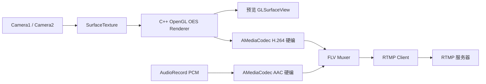

# NativePusher

一个以 C++ 为底层核心的 Android 推流器示例。Kotlin 只负责页面、相机/麦克风输入和 JNI 桥接，OpenGL 渲染、H.264/AAC 硬编、FLV 封装与 RTMP 发送全部在 native 层完成。

## 架构



目录结构：

```text
app/src/main/cpp
├── include/pusher
│   ├── common        # 类型、日志、环形/阻塞队列
│   ├── opengl        # EGL、GL Program、OES 渲染器
│   ├── codec         # VideoEncoder / AudioEncoder
│   ├── output        # FLV Muxer、RTMP Client
│   ├── pipeline      # 音视频归并推流 Pipeline
│   └── core          # StreamEngine 门面
└── src
    ├── common / opengl / codec / output / pipeline / core
    └── jni/JniBridge.cpp
```

## 数据流

- **输入**：`CameraController` 统一 Camera1 / Camera2，视频进入 `SurfaceTexture`，音频由 `AudioRecord` 采集。
- **OpenGL**：native 在 GLSurfaceView 的 EGL 上下文里创建 OES 纹理，相机帧绘制到预览窗口；推流时用共享 EGL 上下文绘制到编码器输入 Surface。
- **编码**：`AMediaCodec` 输出 Annex-B H.264 和 raw AAC，native 提取 SPS/PPS 与 AudioSpecificConfig。
- **输出**：`FlvMuxer` 生成 FLV tag body，`RtmpClient` 完成简单握手、AMF0 `connect/createStream/publish` 与 RTMP 分块发送。
- **Pipeline**：视频、音频各有一条有界队列，按 PTS 归并发送；队列满时丢最旧帧。

## 运行

1. 用 Android Studio 打开本目录（需要 AGP 8.x、NDK 与 CMake）。
2. 连接真机，授权相机和麦克风。
3. 输入 `rtmp://你的服务器/live/stream`，选择分辨率与 Camera1/Camera2，点击“开始推流”。

建议推流到本机/局域网 `nginx-rtmp` 或 SRS 验证。

## 说明

- RTMP 实现面向常见 RTMP 服务器（nginx-rtmp、SRS），未实现 RTMPS、relay 与复杂握手。
- 音频固定 44.1 kHz / 单声道 / 16bit，视频默认 30fps。
- 若某些设备 `AMediaCodec` 的 SPS/PPS 不是启动后立即可见，native 会等待最多约 500ms。
